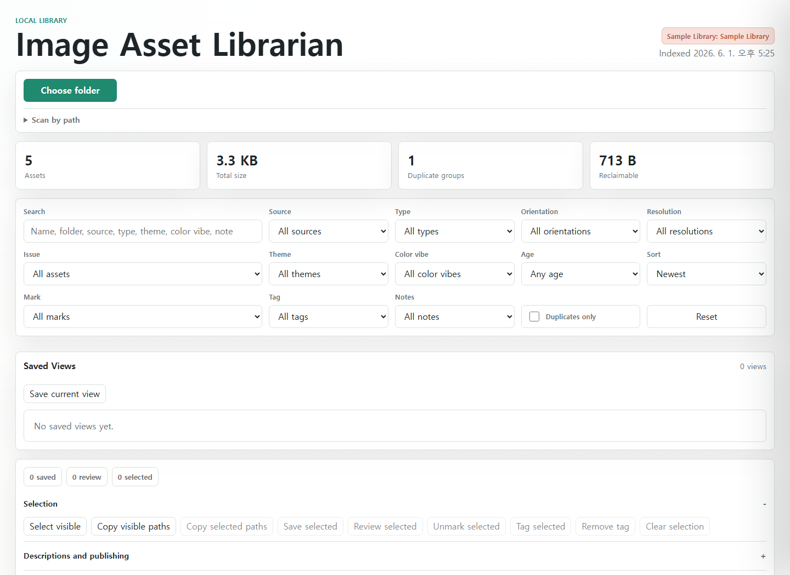

# Image Asset Librarian

[](https://github.com/nmbc23/image-asset-librarian/actions/workflows/ci.yml)

Organize AI image folders locally.

Image Asset Librarian is a small local web app for people with messy AI image output folders. It scans image directories, opens a browser gallery, highlights exact duplicates, groups similar visual themes, and prepares descriptions, alt text, contact sheets, and cleanup notes without uploading private files.



## What You Can Try In Two Minutes

```bash
npm install
npm run scan
npm run serve
```

Open `http://127.0.0.1:4173`.

The default config scans `sample-library/`, so a fresh clone opens with a safe demo library. In the gallery, try:

- Search for `terrace` or `mint`.
- Open a card to inspect metadata, generated description, AI-style review, and copy buttons.
- Use the duplicate and similar-group panels to see how cleanup candidates are surfaced.
- Click "Choose folder" when you are ready to browse for your own image library.

## Demo Scenario

The sample library is intentionally small and public-repo friendly. It includes a few SVG assets, one exact duplicate, and a related visual pair so visitors can test the main workflow quickly:

1. Scan the bundled `sample-library/`.
2. Notice the "Sample Library" badge before touching private files.
3. Filter by source, theme, color vibe, duplicate state, or similar group.
4. Copy a Markdown contact sheet or local description batch.
5. Switch to a real folder and confirm the badge changes to an actual library.

See [docs/demo.md](docs/demo.md) for a guided walkthrough.

## Why It Exists

AI image tools can produce hundreds of files fast. The hard part is not only generating more images. It is finding the useful ones, spotting repeated outputs, keeping notes, and preparing assets for README files, wikis, prompt studies, or publishing.

This project focuses on one workflow: local image-library triage for generated assets.

## Core Features

- Local scanner for PNG, JPG, GIF, SVG, WebP, AVIF, BMP, and TIFF files.
- Browser gallery with search, filters, sort modes, detail drawer navigation, saved/review marks, local tags, and local notes.
- Exact duplicate detection using SHA-256 content hashes with suggested keep files and cleanup-candidate copy actions.
- Similar visual groups from local theme, orientation, color vibe, and palette signals.
- Local descriptions, alt text, AI-style reviews, suggested filenames, contact sheets, CSV, JSON manifests, and Markdown reports.
- Embedded SVG and PNG text metadata extraction for prompt/title search and provenance reports.
- Native browser folder picker for quick local previews, plus a path scanner for users who want to persist `data/index.json`.
- No database, no telemetry, no external network calls in the default workflow.

## Local Rules vs. AI

The current app uses local rules, not cloud AI.

"AI-style" descriptions and reviews are generated from local signals: filenames, folders, dimensions, duplicate status, embedded metadata, inferred themes, color vibes, and palette samples. The app does not call OpenAI, does not upload images, and does not require API keys.

Future AI features, such as real image captioning or embedding-based semantic search, should stay explicit opt-in additions. The local workflow should remain useful without credentials.

## Scan Your Own Folders

The fastest way is to start the server and click "Choose folder". This opens the system folder picker and builds a browser-only gallery from file names, sizes, dates, and preview URLs so large folders appear quickly. When a browser supports direct directory handles, the app can also use that path as an alternate picker.

Use "Scan by path" when you want the Node server to rescan an absolute local path, compute exact duplicate hashes and dimensions, and update `data/index.json`. The gallery refreshes after the scan and remembers recent typed paths in your browser.

For a checked-in-safe config, copy the example file:

```bash
copy asset-librarian.config.example.json asset-librarian.config.local.json
```

Edit `asset-librarian.config.local.json`:

```json
{
  "roots": [
    {
      "name": "Generated Images",
      "path": "D:/Images/generated"
    }
  ],
  "output": "data/index.json"
}
```

Then run:

```bash
node src/cli.js scan --config asset-librarian.config.local.json
node src/server.js --config asset-librarian.config.local.json
```

Keep `asset-librarian.config.local.json` and `data/index.json` out of public commits. They may contain local paths or embedded prompt metadata.

## Scripts

- `npm test` runs the Node test suite.
- `npm run scan` builds `data/index.json` from `asset-librarian.config.json`.
- `npm run report` writes a duplicate review report to `reports/duplicates.md`.
- `npm run serve` starts the local gallery at `http://127.0.0.1:4173`.

## Project Structure

- `src/scanner.js` walks configured roots, extracts metadata, hashes files, and builds the index.
- `src/server.js` serves the local app, image assets, `GET /api/index`, and `POST /api/scan`.
- `public/app.js` renders the gallery and browser-only curation tools.
- `public/view-model.js` keeps filtering and formatting logic testable.
- `sample-library/` is the public demo fixture.

For a deeper overview, see [docs/architecture.md](docs/architecture.md). Privacy details live in [docs/privacy.md](docs/privacy.md). Planned work lives in [ROADMAP.md](ROADMAP.md), and contribution expectations live in [CONTRIBUTING.md](CONTRIBUTING.md).

## Trust Signals

- The default demo works from a fresh clone.
- CI runs `npm test` on supported Node versions.
- The generated local index is ignored by git.
- Runtime code uses Node.js built-ins and browser APIs rather than a hosted backend.
- Documentation separates current local-rule behavior from future optional AI integrations.
