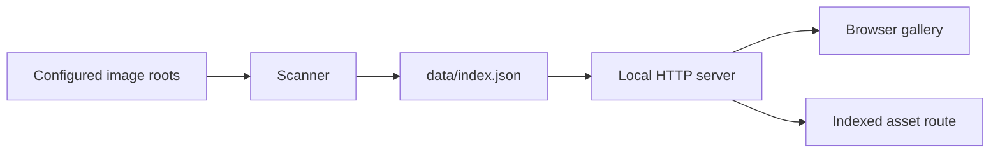

# Architecture

Image Asset Librarian is split into three small layers: scanner, server, and browser UI.

## Scanner

`src/scanner.js` walks configured roots, filters supported image extensions, extracts basic metadata, hashes file contents, and produces a versioned JSON index.

Responsibilities:

- Respect only user-configured roots.
- Ignore unsupported files.
- Record recoverable scan errors without aborting the whole library.
- Group exact duplicates by SHA-256 content hash.

## Config

`src/config.js` loads `asset-librarian.config.json` and resolves root paths relative to the config file. This keeps the default sample config portable while still supporting absolute local paths.

## Server

`src/server.js` serves the static app and exposes two local routes:

- `GET /api/index` returns the generated index.
- `GET /assets/:id` serves only files listed in the generated index.

The server is intentionally small and uses Node.js built-ins only.

## Browser UI

`public/app.js` fetches the index and renders the gallery. `public/view-model.js` keeps filtering, sorting, duplicate detection state, and byte formatting as testable pure functions.

UI responsibilities:

- Search by name, relative path, source, or extension.
- Filter by source, file type, orientation, age, duplicate state, and local review marks.
- Sort by date, size, or name.
- Highlight duplicate assets.
- Store saved/review marks in browser local storage so the generated index stays disposable.
- Copy selected asset paths as a batch for downstream cleanup, curation, or prompt-tracking work.
- Copy a Markdown workflow report summarizing selected, saved, and review-queue assets.
- Keep private local paths visible only to the local user.

## Data Flow

## Design Constraints

- No database.
- No external network calls in the default workflow.
- No required cloud account.
- No hidden telemetry.
- No dependency-heavy framework.
